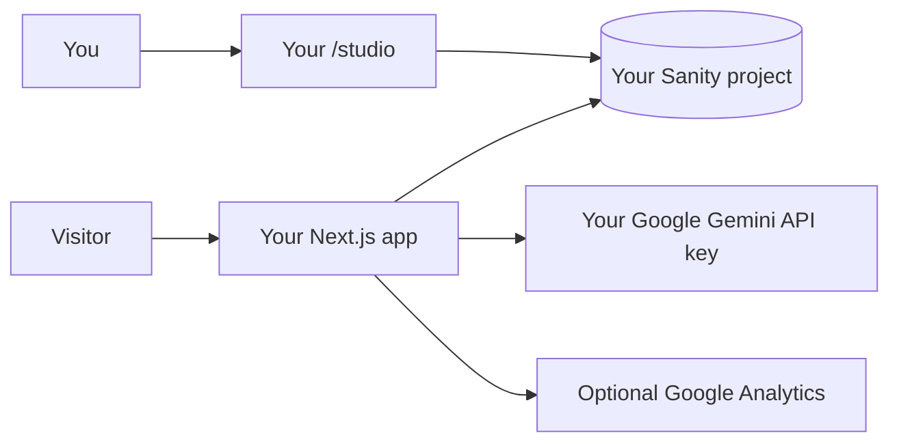

<p align="center">
  <picture>
    <source media="(prefers-color-scheme: dark)" srcset="https://shieldcn.dev/header/graph.svg?title=Portfolio+Website&subtitle=Next.js+%2B+Sanity+%2B+Gemini&logo=nextdotjs&theme=emerald&mode=dark" />
    
  </picture>
</p>

<p align="center">
  A fast, editable portfolio and CV site with a Sanity-powered content studio and an optional AI chat assistant.
</p>

<p align="center">
  <a href="https://github.com/SanekxArcs/portfolio"></a>
  <a href="https://github.com/SanekxArcs/portfolio/forks"></a>
  <a href="https://github.com/SanekxArcs/portfolio/commits/main"></a>
  <a href="https://nextjs.org/"></a>
</p>

## Overview

This is a personal portfolio/CV application built with Next.js 16, React 19, Sanity, Tailwind CSS, and Google Gemini. Content is edited in the embedded Sanity Studio at `/studio`, so the site can be forked and operated with a completely separate content project.

The AI assistant is optional. When enabled, it reads your CV content from your Sanity dataset, answers questions about your work, and stores conversations in your own `chatHistory` documents.

## Features

- Responsive portfolio and CV layout with dark mode
- Sanity Studio mounted at `/studio`
- Rich profile, experience, projects, skills, education, and course schemas
- Optional Gemini-powered chat assistant with message limits and prompt-injection checks
- Chat contact collection and conversation history in Sanity
- Optimized images, metadata, sitemap, robots file, PWA manifest, and Open Graph images
- TypeScript type generation from the Sanity schema

## How the data flows



Your fork does not automatically inherit the original project's Sanity data, Gemini key, hosting account, or analytics. To keep ownership in your hands, create and configure your own services before deploying.

## Fork and self-host it with your own data

### 1. Fork the repository

1. Open the repository on GitHub and select **Fork**.
2. Clone your fork and enter the project directory:

   ```bash
   git clone https://github.com/<your-github-name>/<your-repository>.git
   cd <your-repository>
   ```

3. Do not copy the original project's `.env` or `.env.local` files. Create fresh credentials for every service.

### 2. Create your own Sanity project

1. Create a new project at [sanity.io/manage](https://www.sanity.io/manage).
2. Create a dataset named `production` (or choose another name and use it consistently).
3. Set the dataset to **private** if you want the API to require authentication.
4. Add your local and production website origins to Sanity's [CORS settings](https://www.sanity.io/docs/content-lake/cors). Remove origins you do not control.
5. Create a dedicated API token for server-side chat writes. The current route needs a token with Editor-level write access; never put this token in a `NEXT_PUBLIC_*` variable.
6. Use `/studio` after the first start to create:
   - one `CV Profile` document;
   - one `AI Configuration` document if chat is enabled.

If you already have content in another Sanity project, export and import it deliberately. Do not point your fork at somebody else's dataset when you want isolated ownership.

```bash
# Run these from the project root after authenticating with Sanity CLI
npx sanity datasets export production ./sanity-backup.tar.gz
npx sanity datasets import ./sanity-backup.tar.gz -d production
```

### 3. Create your own Gemini key

Create an API key in [Google AI Studio](https://aistudio.google.com/apikey). The key is used only by `app/api/chat/route.ts`, so keep it server-side and add usage limits in your Google project.

### 4. Configure environment variables

Copy the example file:

```bash
cp .env.local.example .env.local
```

PowerShell:

```powershell
Copy-Item .env.local.example .env.local
```

Fill in the values below. Secrets belong in your host's secret manager, not in Git.

| Variable | Required | Purpose |
| --- | --- | --- |
| `NEXT_PUBLIC_SANITY_PROJECT_ID` | Yes | Your Sanity project ID. This identifier is public. |
| `NEXT_PUBLIC_SANITY_DATASET` | Yes | Your dataset name, normally `production`. |
| `NEXT_PUBLIC_SANITY_API_VERSION` | No | Sanity API version; defaults to `2025-12-15`. |
| `SANITY_API_WRITE_TOKEN` | For chat | Server-only token used to create/update chat history. |
| `SANITY_API_READ_TOKEN` | Private/live data only | Read token used by Sanity Live in the current implementation. Never use a write/admin token here. |
| `GOOGLE_AI_API_KEY` | For chat | Server-only Gemini API key. |
| `NEXT_PUBLIC_SITE_URL` | Recommended | Your public URL, used in the assistant context. |
| `NEXT_PUBLIC_GOOGLE_ANALYTICS_ID` | No | Your own Google Analytics property, if desired. |
| `NEXT_PUBLIC_SANITY_APP_ID` | Sanity Studio deploy only | Optional Sanity application ID used by the CLI deployment config. |

Important: `SANITY_API_WRITE_TOKEN` and `GOOGLE_AI_API_KEY` must never be exposed to the browser. In this codebase, `SANITY_API_READ_TOKEN` is passed to the Sanity Live browser client, so treat it as browser-visible and keep it read-only. If you need strict private-dataset isolation, keep all private reads server-side and remove the browser token from `sanity/lib/live.ts` rather than exposing a token to clients.

### 5. Install and run locally

Next.js 16 requires Node.js 20.9 or newer. Node.js 22 LTS is a good default.

```bash
npm ci
npm run dev
```

Open:

- Site: [http://localhost:3000](http://localhost:3000)
- Sanity Studio: [http://localhost:3000/studio](http://localhost:3000/studio)

The `predev` script generates Sanity types automatically. `npm run typegen` can be run manually after schema changes.

### 6. Deploy your own instance

The app can run on Vercel, a Node.js host, or your own VPS. Configure the same environment variables in the host's secret settings, then run:

```bash
npm ci
npm run build
npm run start
```

For a VPS, put a reverse proxy such as Nginx or Caddy in front of the Node process, enable HTTPS, and keep the app bound to a private/local interface when possible. Set `PORT` if your host does not use port `3000`:

```bash
PORT=3000 npm start
```

Do not deploy with the original Sanity project ID, dataset, write token, Gemini key, analytics ID, or domain settings.

## Privacy and ownership checklist

- [ ] Fork uses a new Sanity project and dataset owned by you.
- [ ] Sanity dataset visibility and CORS origins are configured intentionally.
- [ ] Production secrets are stored only in local/host secret managers.
- [ ] `SANITY_API_WRITE_TOKEN` is server-side and dedicated to this app.
- [ ] `SANITY_API_READ_TOKEN`, when used, is read-only and treated as public.
- [ ] Gemini API key belongs to your Google account/project.
- [ ] Analytics is removed or replaced with your own property.
- [ ] Backups are exported to storage you control.
- [ ] You have reviewed whether chat history should store names, emails, phone numbers, and message content.

The website is public by design: anything you publish in the CV profile can be read by visitors. The privacy goal here is service ownership and isolation—your content and chat records are stored in your accounts, not the original repository owner's accounts. Visitors' messages may still be processed by Google Gemini and your hosting provider according to their policies.

## Useful commands

| Command | Description |
| --- | --- |
| `npm run dev` | Start the local development server |
| `npm run build` | Generate Sanity types and build for production |
| `npm run start` | Start the production server |
| `npm run lint` | Run ESLint |
| `npm run typegen` | Regenerate `schema.json` and `sanity.types.ts` |

## Project structure

```text
app/
  (website)/       Public portfolio routes and layout
  (studio)/        Embedded Sanity Studio at /studio
  api/chat/        Server-side Gemini chat endpoint
components/        UI, CV sections, navigation, and chat UI
sanity/
  schemaTypes/     Sanity content models
  queries/         GROQ queries used by the website and chat
  lib/             Sanity clients and live content helpers
public/             Icons, manifest assets, and static files
```

## License

No license file is currently included. Add a license before distributing a fork as an open-source project.

## References

- [ShieldCN README Studio](https://shieldcn.dev/studio)
- [Sanity dataset security](https://www.sanity.io/docs/content-lake/keeping-your-data-safe)
- [Sanity CORS settings](https://www.sanity.io/docs/content-lake/cors)
- [Next.js self-hosting](https://nextjs.org/docs/app/guides/self-hosting)
